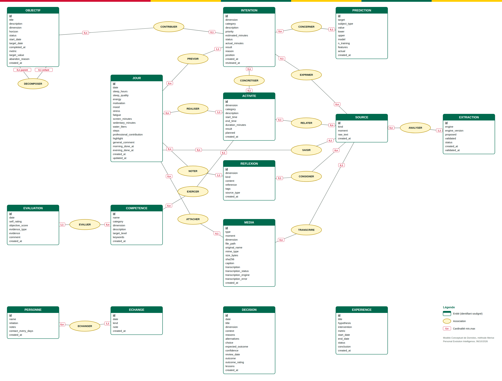

# Modèle Conceptuel de Données de PEI

*Personal Evolution Intelligence, 06/10/2026*

## 1. Qu'est ce que le MCD ?

Le Modèle Conceptuel de Données (méthode Merise) décrit les informations manipulées par PEI indépendamment de toute technique : des **entités** (objets du réel ayant une existence propre), reliées par des **associations** (verbes qui expriment un lien de sens), chacune affectée de **cardinalités** qui disent combien de fois une occurrence d'entité participe à l'association.

* Une **entité** est représentée par un rectangle vert. Sa première propriété, soulignée, est son identifiant.
* Une **association** est représentée par une ellipse jaune portant un verbe à l'infinitif.
* Une **cardinalité** « min,max » est écrite en rouge sur chaque patte : le minimum (0 ou 1) dit si la participation est facultative ou obligatoire, le maximum (1 ou n) dit si elle est unique ou multiple.
* Au niveau conceptuel il n'y a pas de clé étrangère : elles n'apparaissent qu'au passage au modèle logique (MLD).

Le MCD de PEI compte **15 entités** et **17 associations**. Il est organisé autour de deux pivots : **JOUR**, qui donne la dimension longitudinale (tout se rattache à une date), et **SOURCE**, qui garantit la traçabilité (toute donnée structurée remonte à sa donnée brute).

## 2. Le schéma

Version vectorielle : [mcd.svg](mcd.svg)

Le schéma est fourni en vectoriel (docs/mcd.svg et page précédente du PDF) : il peut être zoomé sans perte.

## 3. Les entités

| Entité | Table | Rôle | Propriétés |
|---|---|---|---|
| JOUR | days | Une journée vécue et ses indicateurs déclarés (sommeil, énergie, humeur...). | 20 |
| OBJECTIF | goals | Objectif hiérarchique, de la vision jusqu'à l'objectif hebdomadaire. | 13 |
| INTENTION | intentions | Ce que je veux faire un jour donné (niveau Intention). | 13 |
| ACTIVITE | activities | Ce que j'ai réellement fait et ce que cela a produit (niveaux Action et Résultat). | 10 |
| REFLEXION | reflections | Réflexion typée : apprentissage, gratitude, difficulté, passage biblique... | 8 |
| MEDIA | media | Métadonnées d'un fichier audio, vidéo, image ou document conservé dans storage/. | 15 |
| SOURCE | sources | Donnée brute d'origine (texte saisi, audio transcrit, formulaire), jamais modifiée. | 5 |
| EXTRACTION | extractions | Proposition de l'IA sur une source, puis sa version validée ou corrigée. | 8 |
| PREDICTION | predictions | Estimation émise par un modèle, conservée pour être comparée à la réalité. | 11 |
| COMPETENCE | skills | Compétence suivie dans le temps. | 8 |
| EVALUATION | skill_progress | Point d'évaluation d'une compétence : ressenti et preuve objective. | 8 |
| DECISION | decisions | Décision importante : contexte, raisons, choix, puis résultat observé. | 15 |
| EXPERIENCE | experiments | Expérience personnelle : hypothèse testée sur une période. | 10 |
| PERSONNE | people | Personne de l'entourage (famille, ami, mentor...). | 6 |
| ECHANGE | interactions | Échange avec une personne : appel, visite, rencontre, message. | 5 |

Trois groupes se dégagent :

* **Le cœur quotidien** : JOUR, INTENTION, ACTIVITE, REFLEXION, MEDIA. Il traduit la chaîne Intention, Action, Résultat (le résultat est une propriété de l'activité et de l'intention).
* **La traçabilité et l'intelligence** : SOURCE, EXTRACTION, PREDICTION. Elles conservent la donnée brute, ce que l'IA en a tiré, ce que l'utilisateur a validé, et ce que les modèles ont prédit.
* **Les dimensions longues** : OBJECTIF, COMPETENCE, EVALUATION, DECISION, EXPERIENCE, PERSONNE, ECHANGE.

## 4. Les associations et leurs cardinalités

Chaque ligne se lit dans les deux sens. Exemple pour PREVOIR : « une JOUR(née) prévoit 0 à n intentions » et « une INTENTION est prévue pour 1 et 1 seul jour ».

| Association | Entité A | Card. A | Entité B | Card. B | Lecture |
|---|---|---|---|---|---|
| DECOMPOSER | OBJECTIF (parent) | 0,n | OBJECTIF (enfant) | 0,1 | Un objectif peut se décomposer en plusieurs sous objectifs ; un objectif a au plus un objectif parent. |
| CONTRIBUER | OBJECTIF | 0,n | INTENTION | 0,1 | Un objectif reçoit la contribution de zéro ou plusieurs intentions ; une intention contribue à au plus un objectif. |
| PREVOIR | JOUR | 0,n | INTENTION | 1,1 | Une journée comporte zéro ou plusieurs intentions ; une intention est prévue pour exactement une journée. |
| CONCERNER | INTENTION | 0,n | PREDICTION | 0,1 | Une intention peut faire l'objet de plusieurs prédictions ; une prédiction concerne au plus une intention. |
| EXPRIMER | SOURCE | 0,n | INTENTION | 0,1 | Une source peut exprimer plusieurs intentions ; une intention provient d'au plus une source. |
| REALISER | JOUR | 0,n | ACTIVITE | 1,1 | Une journée comporte zéro ou plusieurs activités ; une activité a lieu exactement un jour. |
| CONCRETISER | INTENTION | 0,n | ACTIVITE | 0,1 | Une intention peut être concrétisée par plusieurs activités ; une activité concrétise au plus une intention. |
| RELATER | SOURCE | 0,n | ACTIVITE | 0,1 | Une source peut relater plusieurs activités ; une activité provient d'au plus une source. |
| SAISIR | JOUR | 0,n | SOURCE | 0,1 | Une journée regroupe zéro ou plusieurs sources ; une source est rattachée à au plus une journée. |
| NOTER | JOUR | 0,n | REFLEXION | 1,1 | Une journée comporte zéro ou plusieurs réflexions ; une réflexion appartient exactement à une journée. |
| CONSIGNER | SOURCE | 0,n | REFLEXION | 0,1 | Une source peut consigner plusieurs réflexions ; une réflexion provient d'au plus une source. |
| ATTACHER | JOUR | 0,n | MEDIA | 0,1 | Une journée peut avoir plusieurs médias ; un média est rattaché à au plus une journée. |
| TRANSCRIRE | MEDIA | 0,n | SOURCE | 0,1 | Un média peut donner lieu à des sources (sa transcription) ; une source provient d'au plus un média. |
| ANALYSER | SOURCE | 0,n | EXTRACTION | 1,1 | Une source peut être analysée plusieurs fois ; une extraction porte sur exactement une source. |
| EXERCER | COMPETENCE | 0,n | ACTIVITE | 0,1 | Une compétence est exercée par zéro ou plusieurs activités ; une activité exerce au plus une compétence. |
| EVALUER | COMPETENCE | 0,n | EVALUATION | 1,1 | Une compétence reçoit zéro ou plusieurs évaluations ; une évaluation concerne exactement une compétence. |
| ECHANGER | PERSONNE | 0,n | ECHANGE | 1,1 | Une personne a zéro ou plusieurs échanges ; un échange concerne exactement une personne. |

## 5. Justification des cardinalités

* **Minimum 1 côté INTENTION, ACTIVITE, REFLEXION (PREVOIR, REALISER, NOTER)** : ces éléments n'ont pas de sens hors d'une journée. Supprimer une journée supprime donc ses intentions, activités et réflexions (cascade).
* **Minimum 0 côté JOUR** : une journée peut exister sans intention, par exemple si seul le sommeil a été saisi.
* **CONCRETISER (0,n) / (0,1)** : une activité peut être imprévue (aucune intention), et une intention peut être réalisée en plusieurs séances ; c'est ce lien qui permet de comparer le prévu et le réalisé.
* **CONTRIBUER (0,n) / (0,1)** : une intention n'est pas obligatoirement reliée à un objectif ; quand elle l'est, le temps consacré remonte, par DECOMPOSER, jusqu'à la vision.
* **DECOMPOSER, association réflexive** : un objectif a au plus un parent (0,1) et peut avoir plusieurs sous objectifs (0,n). La vision est un objectif sans parent.
* **EXPRIMER, RELATER, CONSIGNER (0,n) / (0,1)** : une même saisie (par exemple le bilan dicté du soir) peut produire plusieurs éléments structurés ; un élément saisi directement au formulaire peut ne pas avoir de source.
* **ANALYSER (0,n) / (1,1)** : une extraction n'existe que par sa source ; une source peut être analysée plusieurs fois (nouvelle version du moteur), sans jamais être modifiée.
* **TRANSCRIRE (0,n) / (0,1)** : un média audio ou vidéo donne naissance à une source qui contient sa transcription ; une image ou un document n'en produit pas. Le fichier d'origine n'est jamais altéré.
* **ATTACHER et SAISIR (0,n) / (0,1)** : un média ou une source est normalement daté, mais peut exister sans journée (import ultérieur) ; si la journée est supprimée, le lien est mis à vide sans perdre l'original.
* **EXERCER (0,n) / (0,1)** : le rattachement d'une activité à une compétence est automatique (mots clés) et facultatif.
* **EVALUER et ECHANGER (0,n) / (1,1)** : une évaluation n'existe que pour une compétence, un échange que pour une personne.
* **CONCERNER (0,n) / (0,1)** : une prédiction porte en général sur une intention. Dans l'implémentation le lien est *polymorphe* (subject_type, subject_id) afin de pouvoir, plus tard, prédire sur d'autres objets (compétence, objectif) sans changer le schéma.

## 6. Entités indépendantes et choix de modélisation

* **DECISION** et **EXPERIENCE** ne sont reliées à aucune entité : elles se rattachent au temps par leurs propres dates. L'expérience compare un indicateur (propriété metric) calculé sur les journées de sa période et de la période précédente : c'est un lien de calcul, pas une association stockée.
* La **dimension** de vie (spirituel, physique, études...) et les **statuts** sont des propriétés à domaine de valeurs fermé, définies dans backend/domain.py, plutôt que des entités : la liste est stable, et cela évite des jointures dans toutes les analyses. Si l'utilisateur doit un jour créer ses propres dimensions, on ajoutera une entité DIMENSION reliée par une association (0,n) / (0,1).
* Le **Résultat** de la chaîne Intention, Action, Résultat est une propriété (result) de l'activité et de l'intention, car il est toujours unique et décrit en texte libre.
* La table technique **memory_index** (index plein texte FTS5) n'apparaît pas dans le MCD : c'est une structure d'accès dérivée, reconstruisible à tout moment (python run.py reindex).

## 7. Passage au Modèle Logique de Données (MLD)

Règles appliquées : chaque entité devient une table, son identifiant devient la clé primaire. Pour une association de type (x,n) / (x,1), la clé primaire du côté n migre comme clé étrangère dans la table du côté 1. Si le minimum est 0, la clé étrangère peut être vide ; s'il vaut 1, elle est obligatoire. Aucune association n'est de type (n,n), il n'y a donc pas de table de liaison.

* **days** (__id__, date, sleep_hours, sleep_quality, energy, motivation, mood, stress, fatigue, screen_minutes, sedentary_minutes, water_liters, steps, professional_contribution, highlight, general_comment, morning_done_at, evening_done_at, created_at, updated_at)
* **goals** (__id__, #parent_id, title, description, dimension, horizon, status, start_date, target_date, completed_at, metric, target_value, abandon_reason, created_at)
* **intentions** (__id__, #day_id, #goal_id, dimension, category, description, priority, estimated_minutes, status, actual_minutes, result, reason, position, #source_id, created_at, reviewed_at)
* **activities** (__id__, #day_id, #intention_id, #skill_id, dimension, category, description, start_time, end_time, duration_minutes, result, planned, #source_id, created_at)
* **reflections** (__id__, #day_id, dimension, kind, content, reference, tags, source_type, #source_id, created_at)
* **media** (__id__, #day_id, type, moment, dimension, file_path, original_name, mime_type, size_bytes, sha256, caption, transcription, transcription_status, transcription_engine, transcription_error, created_at)
* **sources** (__id__, #day_id, kind, moment, raw_text, #media_id, created_at)
* **extractions** (__id__, #source_id, engine, engine_version, proposed, validated, status, created_at, validated_at)
* **predictions** (__id__, target, subject_type, #subject_id, value, lower, upper, model, n_training, features, actual, created_at)
* **skills** (__id__, name, category, dimension, description, target_level, keywords, created_at)
* **skill_progress** (__id__, #skill_id, date, self_rating, objective_score, evidence_type, evidence, comment, created_at)
* **decisions** (__id__, date, title, dimension, context, reasons, alternatives, choice, expected_outcome, confidence, review_date, outcome, outcome_rating, lessons, created_at)
* **experiments** (__id__, title, hypothesis, intervention, metric, start_date, end_date, status, conclusion, created_at)
* **people** (__id__, name, relation, notes, contact_every_days, created_at)
* **interactions** (__id__, #person_id, date, kind, note, created_at)

Notation : identifiant souligné, clé étrangère précédée de #.

| Association | Clé étrangère créée | Référence | Nature |
|---|---|---|---|
| DECOMPOSER | goals.parent_id | goals | Facultative |
| CONTRIBUER | intentions.goal_id | goals | Facultative |
| PREVOIR | intentions.day_id | days | Obligatoire |
| CONCERNER | predictions.subject_id | intentions | Facultative |
| EXPRIMER | intentions.source_id | sources | Facultative |
| REALISER | activities.day_id | days | Obligatoire |
| CONCRETISER | activities.intention_id | intentions | Facultative |
| RELATER | activities.source_id | sources | Facultative |
| SAISIR | sources.day_id | days | Facultative |
| NOTER | reflections.day_id | days | Obligatoire |
| CONSIGNER | reflections.source_id | sources | Facultative |
| ATTACHER | media.day_id | days | Facultative |
| TRANSCRIRE | sources.media_id | media | Facultative |
| ANALYSER | extractions.source_id | sources | Obligatoire |
| EXERCER | activities.skill_id | skills | Facultative |
| EVALUER | skill_progress.skill_id | skills | Obligatoire |
| ECHANGER | interactions.person_id | people | Obligatoire |

Comportement à la suppression : les clés obligatoires vers JOUR, SOURCE, COMPETENCE et PERSONNE sont en suppression en cascade ; les clés facultatives sont mises à vide (SET NULL), afin de ne jamais perdre une donnée d'origine.

## 8. Dictionnaire des données : propriétés de chaque table

Pour chaque table : nom de la propriété, type, contraintes et signification. Les échelles 1 à 5 vont du plus faible au plus fort.

### JOUR (table days)

Une journée vécue et ses indicateurs déclarés (sommeil, énergie, humeur...).

| Propriété | Type | Contraintes | Description |
|---|---|---|---|
| id | Entier | Clé primaire | Identifiant de la journée |
| date | Date | Unique, Obligatoire | Date calendaire, unique |
| sleep_hours | Réel | Facultatif | Durée de sommeil en heures (0 à 24) |
| sleep_quality | Entier | Facultatif | Qualité du sommeil (1 à 5) |
| energy | Entier | Facultatif | Niveau d'énergie déclaré (1 à 5) |
| motivation | Entier | Facultatif | Motivation déclarée (1 à 5) |
| mood | Entier | Facultatif | Humeur déclarée (1 à 5) |
| stress | Entier | Facultatif | Niveau de stress (1 à 5) |
| fatigue | Entier | Facultatif | Fatigue (1 à 5) |
| screen_minutes | Entier | Facultatif | Temps d'écran en minutes |
| sedentary_minutes | Entier | Facultatif | Temps sédentaire en minutes |
| water_liters | Réel | Facultatif | Eau bue en litres |
| steps | Entier | Facultatif | Nombre de pas |
| professional_contribution | Texte long | Facultatif | Réponse à « Qu'ai je fait aujourd'hui pour mon évolution professionnelle ? » |
| highlight | Texte long | Facultatif | Ce qui a marqué la journée |
| general_comment | Texte long | Facultatif | Commentaire libre du soir |
| morning_done_at | Date et heure | Facultatif | Horodatage de la validation du matin |
| evening_done_at | Date et heure | Facultatif | Horodatage du bilan du soir |
| created_at | Date et heure | Obligatoire, Défaut : maintenant | Date de création |
| updated_at | Date et heure | Obligatoire, Défaut : maintenant | Date de dernière modification |

### OBJECTIF (table goals)

Objectif hiérarchique, de la vision jusqu'à l'objectif hebdomadaire.

| Propriété | Type | Contraintes | Description |
|---|---|---|---|
| id | Entier | Clé primaire | Identifiant de l'objectif |
| parent_id | Entier | Clé étrangère vers goals | Objectif parent (décomposition) |
| title | Texte (300) | Obligatoire | Intitulé |
| description | Texte long | Facultatif | Description détaillée |
| dimension | Texte (40) | Facultatif | Dimension de vie |
| horizon | Texte (30) | Obligatoire, Défaut : mensuel | vision, long_terme, annuel, mensuel ou hebdomadaire |
| status | Texte (30) | Obligatoire, Défaut : actif | actif, atteint, en_pause, abandonne |
| start_date | Date | Facultatif | Date de début |
| target_date | Date | Facultatif | Échéance visée |
| completed_at | Date | Facultatif | Date d'atteinte |
| metric | Texte (200) | Facultatif | Indicateur de réussite (ex. nombre de projets) |
| target_value | Réel | Facultatif | Valeur cible de l'indicateur |
| abandon_reason | Texte long | Facultatif | Raison d'un abandon |
| created_at | Date et heure | Obligatoire, Défaut : maintenant | Date de création |

### INTENTION (table intentions)

Ce que je veux faire un jour donné (niveau Intention).

| Propriété | Type | Contraintes | Description |
|---|---|---|---|
| id | Entier | Clé primaire | Identifiant de l'intention |
| day_id | Entier | Clé étrangère vers days, Obligatoire | Journée concernée |
| goal_id | Entier | Clé étrangère vers goals | Objectif auquel elle contribue |
| dimension | Texte (40) | Facultatif | Dimension de vie |
| category | Texte (120) | Facultatif | Type d'activité (Python, Sport...) |
| description | Texte long | Obligatoire | Intention formulée |
| priority | Entier | Obligatoire, Défaut : 2 | 1 haute, 2 normale, 3 basse |
| estimated_minutes | Entier | Facultatif | Durée prévue en minutes |
| status | Texte (20) | Obligatoire, Défaut : prevu | prevu, realise, partiel, non_realise, abandonne, reporte |
| actual_minutes | Entier | Facultatif | Durée réellement consacrée |
| result | Texte long | Facultatif | Résultat obtenu |
| reason | Texte long | Facultatif | Raison d'un abandon ou d'un écart |
| position | Entier | Obligatoire, Défaut : 0 | Ordre d'affichage dans la journée |
| source_id | Entier | Clé étrangère vers sources | Source d'origine (saisie du matin) |
| created_at | Date et heure | Obligatoire, Défaut : maintenant | Date de création |
| reviewed_at | Date et heure | Facultatif | Date du bilan de cette intention |

### ACTIVITE (table activities)

Ce que j'ai réellement fait et ce que cela a produit (niveaux Action et Résultat).

| Propriété | Type | Contraintes | Description |
|---|---|---|---|
| id | Entier | Clé primaire | Identifiant de l'activité |
| day_id | Entier | Clé étrangère vers days, Obligatoire | Journée où elle a eu lieu |
| intention_id | Entier | Clé étrangère vers intentions | Intention qu'elle concrétise (vide si non prévue) |
| skill_id | Entier | Clé étrangère vers skills | Compétence exercée |
| dimension | Texte (40) | Facultatif | Dimension de vie |
| category | Texte (120) | Facultatif | Type d'activité |
| description | Texte long | Obligatoire | Ce qui a été fait |
| start_time | Texte (5) | Facultatif | Heure de début (HH:MM) |
| end_time | Texte (5) | Facultatif | Heure de fin (HH:MM) |
| duration_minutes | Entier | Facultatif | Durée en minutes |
| result | Texte long | Facultatif | Ce que l'activité a produit |
| planned | Booléen | Obligatoire, Défaut : False | Vrai si l'activité était prévue |
| source_id | Entier | Clé étrangère vers sources | Source d'origine |
| created_at | Date et heure | Obligatoire, Défaut : maintenant | Date de création |

### REFLEXION (table reflections)

Réflexion typée : apprentissage, gratitude, difficulté, passage biblique...

| Propriété | Type | Contraintes | Description |
|---|---|---|---|
| id | Entier | Clé primaire | Identifiant |
| day_id | Entier | Clé étrangère vers days, Obligatoire | Journée concernée |
| dimension | Texte (40) | Facultatif | Dimension de vie |
| kind | Texte (30) | Obligatoire, Défaut : reflexion | reflexion, apprentissage, difficulte, gratitude, idee, evenement, passage, engagement... |
| content | Texte long | Obligatoire | Texte de la réflexion |
| reference | Texte (200) | Facultatif | Référence (passage biblique, livre, lien) |
| tags | Texte (300) | Facultatif | Mots clés libres |
| source_type | Texte (20) | Obligatoire, Défaut : texte | texte ou audio |
| source_id | Entier | Clé étrangère vers sources | Source d'origine |
| created_at | Date et heure | Obligatoire, Défaut : maintenant | Date de création |

### MEDIA (table media)

Métadonnées d'un fichier audio, vidéo, image ou document conservé dans storage/.

| Propriété | Type | Contraintes | Description |
|---|---|---|---|
| id | Entier | Clé primaire | Identifiant du média |
| day_id | Entier | Clé étrangère vers days | Journée de rattachement |
| type | Texte (20) | Obligatoire | audio, video, image, document |
| moment | Texte (20) | Facultatif | matin, journee, soir |
| dimension | Texte (40) | Facultatif | Dimension de vie |
| file_path | Texte (500) | Obligatoire | Chemin du fichier, relatif à storage/ |
| original_name | Texte (300) | Facultatif | Nom d'origine du fichier |
| mime_type | Texte (100) | Facultatif | Type MIME |
| size_bytes | Entier | Facultatif | Taille en octets |
| sha256 | Texte (64) | Facultatif | Empreinte d'intégrité du fichier |
| caption | Texte long | Facultatif | Légende |
| transcription | Texte long | Facultatif | Texte transcrit (audio, vidéo) |
| transcription_status | Texte (20) | Facultatif | en_attente, en_cours, termine, indisponible, erreur |
| transcription_engine | Texte (80) | Facultatif | Moteur utilisé (ex. faster-whisper:small) |
| transcription_error | Texte long | Facultatif | Message d'erreur éventuel |
| created_at | Date et heure | Obligatoire, Défaut : maintenant | Date d'enregistrement |

### SOURCE (table sources)

Donnée brute d'origine (texte saisi, audio transcrit, formulaire), jamais modifiée.

| Propriété | Type | Contraintes | Description |
|---|---|---|---|
| id | Entier | Clé primaire | Identifiant de la source |
| day_id | Entier | Clé étrangère vers days | Journée concernée |
| kind | Texte (30) | Obligatoire | texte, audio, video, formulaire |
| moment | Texte (20) | Facultatif | matin, journee, soir |
| raw_text | Texte long | Facultatif | Texte brut d'origine ou transcription |
| media_id | Entier | Clé étrangère vers media | Média d'origine (si audio ou vidéo) |
| created_at | Date et heure | Obligatoire, Défaut : maintenant | Date de création |

### EXTRACTION (table extractions)

Proposition de l'IA sur une source, puis sa version validée ou corrigée.

| Propriété | Type | Contraintes | Description |
|---|---|---|---|
| id | Entier | Clé primaire | Identifiant |
| source_id | Entier | Clé étrangère vers sources, Obligatoire | Source analysée |
| engine | Texte (80) | Obligatoire | Moteur d'extraction |
| engine_version | Texte (20) | Obligatoire | Version du moteur |
| proposed | JSON | Obligatoire | Proposition de l'IA (JSON) |
| validated | JSON | Facultatif | Version validée par l'utilisateur (JSON) |
| status | Texte (20) | Obligatoire, Défaut : propose | propose, valide, corrige, rejete |
| created_at | Date et heure | Obligatoire, Défaut : maintenant | Date de la proposition |
| validated_at | Date et heure | Facultatif | Date de validation |

### PREDICTION (table predictions)

Estimation émise par un modèle, conservée pour être comparée à la réalité.

| Propriété | Type | Contraintes | Description |
|---|---|---|---|
| id | Entier | Clé primaire | Identifiant |
| target | Texte (60) | Obligatoire | Ce qui est prédit : completion, duree... |
| subject_type | Texte (40) | Facultatif | Type d'objet concerné (ex. intention) |
| subject_id | Entier | Référence polymorphe | Identifiant de l'objet concerné |
| value | Réel | Obligatoire | Valeur prédite (probabilité, minutes...) |
| lower | Réel | Facultatif | Borne basse de l'intervalle |
| upper | Réel | Facultatif | Borne haute de l'intervalle |
| model | Texte (80) | Obligatoire | Modèle utilisé |
| n_training | Entier | Facultatif | Taille de l'historique d'apprentissage |
| features | JSON | Facultatif | Variables utilisées (JSON) |
| actual | Réel | Facultatif | Valeur réellement observée ensuite |
| created_at | Date et heure | Obligatoire, Défaut : maintenant | Date de la prédiction |

### COMPETENCE (table skills)

Compétence suivie dans le temps.

| Propriété | Type | Contraintes | Description |
|---|---|---|---|
| id | Entier | Clé primaire | Identifiant |
| name | Texte (120) | Unique, Obligatoire | Nom de la compétence, unique |
| category | Texte (120) | Facultatif | Famille (ex. Data science) |
| dimension | Texte (40) | Facultatif | Dimension de vie |
| description | Texte long | Facultatif | Description |
| target_level | Entier | Facultatif | Niveau visé (1 à 5) |
| keywords | Texte (300) | Facultatif | Mots clés reliant automatiquement les activités |
| created_at | Date et heure | Obligatoire, Défaut : maintenant | Date de création |

### EVALUATION (table skill_progress)

Point d'évaluation d'une compétence : ressenti et preuve objective.

| Propriété | Type | Contraintes | Description |
|---|---|---|---|
| id | Entier | Clé primaire | Identifiant |
| skill_id | Entier | Clé étrangère vers skills, Obligatoire | Compétence évaluée |
| date | Date | Obligatoire | Date de l'évaluation |
| self_rating | Réel | Facultatif | Auto évaluation (0 à 5) |
| objective_score | Réel | Facultatif | Score objectif (0 à 100) |
| evidence_type | Texte (40) | Facultatif | exercice, projet, test, formation, production |
| evidence | Texte long | Facultatif | Description de la preuve |
| comment | Texte long | Facultatif | Commentaire |
| created_at | Date et heure | Obligatoire, Défaut : maintenant | Date de création |

### DECISION (table decisions)

Décision importante : contexte, raisons, choix, puis résultat observé.

| Propriété | Type | Contraintes | Description |
|---|---|---|---|
| id | Entier | Clé primaire | Identifiant |
| date | Date | Obligatoire | Date de la décision |
| title | Texte (300) | Obligatoire | Décision |
| dimension | Texte (40) | Facultatif | Dimension de vie |
| context | Texte long | Facultatif | Contexte |
| reasons | Texte long | Facultatif | Raisons |
| alternatives | Texte long | Facultatif | Alternatives envisagées |
| choice | Texte long | Facultatif | Choix effectué |
| expected_outcome | Texte long | Facultatif | Résultat attendu |
| confidence | Entier | Facultatif | Confiance (1 à 5) |
| review_date | Date | Facultatif | Date prévue pour juger le résultat |
| outcome | Texte long | Facultatif | Résultat observé |
| outcome_rating | Entier | Facultatif | Appréciation du résultat (1 à 5) |
| lessons | Texte long | Facultatif | Leçon tirée |
| created_at | Date et heure | Obligatoire, Défaut : maintenant | Date de création |

### EXPERIENCE (table experiments)

Expérience personnelle : hypothèse testée sur une période.

| Propriété | Type | Contraintes | Description |
|---|---|---|---|
| id | Entier | Clé primaire | Identifiant |
| title | Texte (300) | Obligatoire | Titre |
| hypothesis | Texte long | Obligatoire | Hypothèse testée |
| intervention | Texte long | Facultatif | Ce qui est changé |
| metric | Texte (60) | Obligatoire | Indicateur observé (colonne de la série quotidienne) |
| start_date | Date | Obligatoire | Début |
| end_date | Date | Facultatif | Fin (vide si en cours) |
| status | Texte (20) | Obligatoire, Défaut : en_cours | en_cours, termine |
| conclusion | Texte long | Facultatif | Conclusion |
| created_at | Date et heure | Obligatoire, Défaut : maintenant | Date de création |

### PERSONNE (table people)

Personne de l'entourage (famille, ami, mentor...).

| Propriété | Type | Contraintes | Description |
|---|---|---|---|
| id | Entier | Clé primaire | Identifiant |
| name | Texte (200) | Obligatoire | Nom |
| relation | Texte (60) | Facultatif | famille, ami, collègue, mentor, communauté |
| notes | Texte long | Facultatif | Notes |
| contact_every_days | Entier | Facultatif | Rythme de contact souhaité en jours |
| created_at | Date et heure | Obligatoire, Défaut : maintenant | Date de création |

### ECHANGE (table interactions)

Échange avec une personne : appel, visite, rencontre, message.

| Propriété | Type | Contraintes | Description |
|---|---|---|---|
| id | Entier | Clé primaire | Identifiant |
| person_id | Entier | Clé étrangère vers people, Obligatoire | Personne concernée |
| date | Date | Obligatoire | Date de l'échange |
| kind | Texte (30) | Obligatoire, Défaut : conversation | appel, visite, message, rencontre, conversation |
| note | Texte long | Facultatif | Note sur l'échange |
| created_at | Date et heure | Obligatoire, Défaut : maintenant | Date de création |
