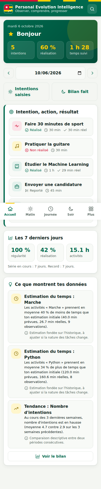
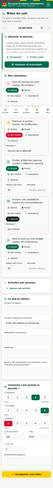
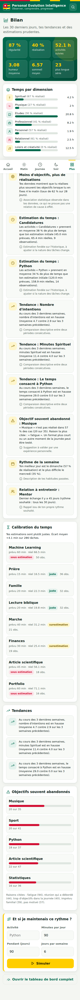
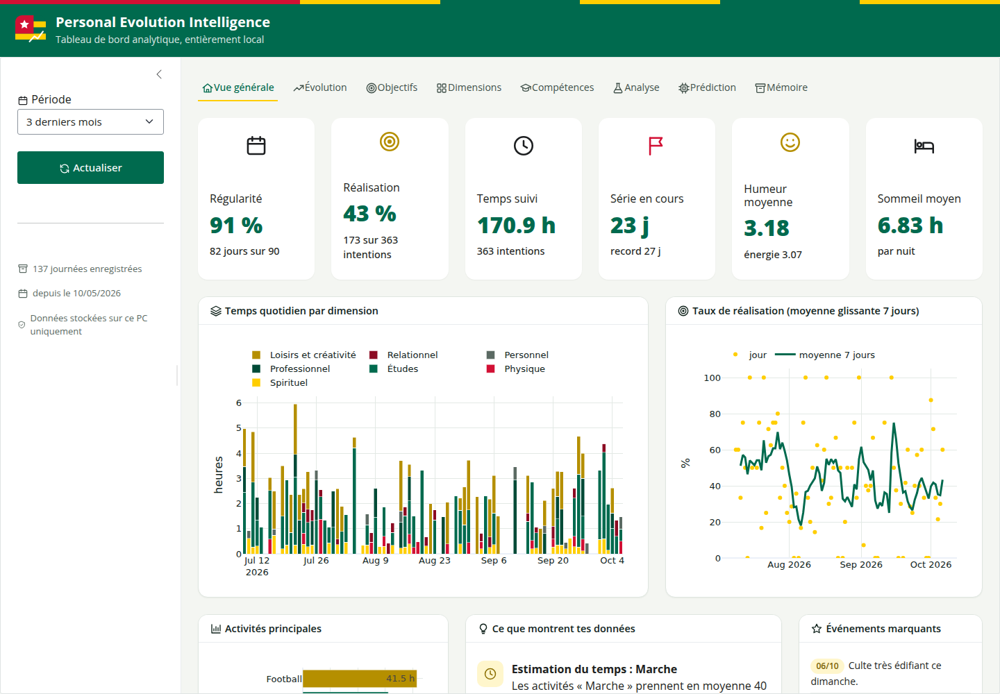
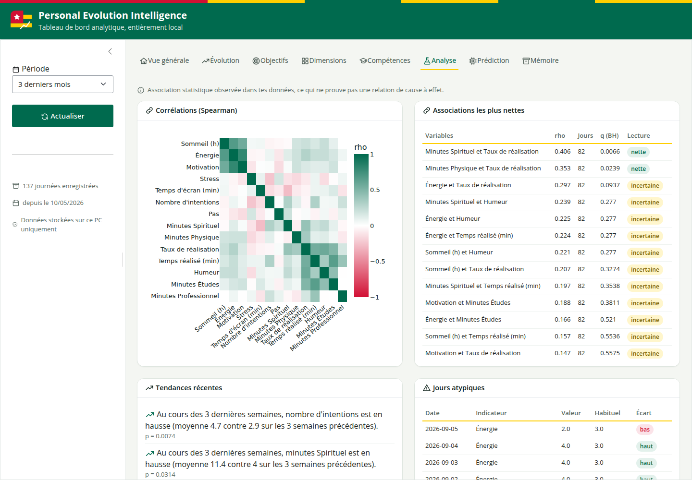
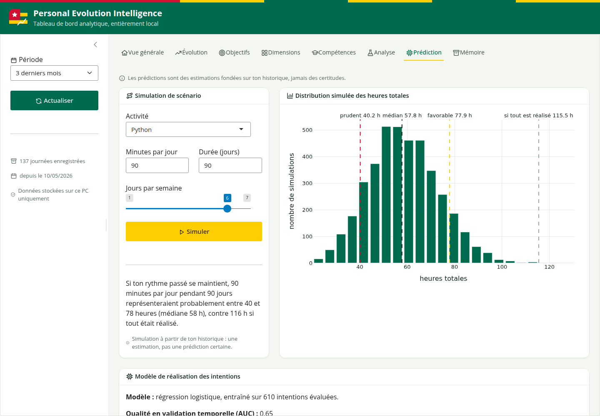

# Personal Evolution Intelligence (PEI)

## Rapport explicatif

*Version 1.0, 06/10/2026*

## 1. Résumé

Personal Evolution Intelligence (PEI) est un système personnel, entièrement local, qui transforme le vécu quotidien en données structurées afin d'observer objectivement son évolution. Il ne se limite pas à une liste de tâches : il enregistre ce que l'on voulait faire (intention), ce que l'on a réellement fait (action) et ce que cela a produit (résultat), puis en tire des statistiques, des tendances, des estimations et des recommandations toujours justifiées par les données.

La version livrée couvre les huit phases du cahier des charges dans une première version fonctionnelle : socle FastAPI et SQLite, interface téléphone installable (PWA), multimédia avec transcription locale, extraction automatique en français, tableau de bord Shiny for Python, analyse statistique longitudinale, modèles prédictifs et recommandations. L'ensemble représente environ 5 600 lignes de Python et 1 300 lignes d'interface web, validées par 19 tests automatisés.

| Élément | Choix retenu |
|---|---|
| Backend | Python, FastAPI, SQLAlchemy |
| Base de données | SQLite (WAL, clés étrangères, index plein texte FTS5) |
| Interface téléphone | Application web installable (PWA), sans bibliothèque externe |
| Tableau de bord | Shiny for Python et Plotly |
| Analyse | Pandas, NumPy, SciPy, Statsmodels |
| Apprentissage | Scikit learn (régression logistique, validation temporelle) |
| Transcription | Whisper local (faster whisper ou openai whisper) |
| Identité visuelle | Couleurs du drapeau togolais, icônes dessinées en Python, aucun emoji |

## 2. Contexte et problématique

Les outils de productivité répondent à la question « Qu'est ce que je dois faire ? ». Ils répondent mal à « Qu'est ce que je fais réellement ? », « Comment suis je en train d'évoluer ? » ou « Quels comportements accompagnent mes meilleures périodes ? ». PEI vise à passer d'une logique de gestion des tâches à une logique de compréhension longitudinale de soi, selon le cycle :

**Observer, collecter, structurer, analyser, apprendre, prédire, recommander, observer à nouveau.**

L'intelligence artificielle n'y décide jamais à la place de l'utilisateur : elle propose, l'utilisateur valide ou corrige, et la donnée d'origine reste toujours consultable.

## 3. Couverture des objectifs spécifiques

| Objectif du cahier des charges | Réalisation dans PEI |
|---|---|
| 1. Intentions quotidiennes | Page Matin : texte, formulaire ou audio, puis validation |
| 2. Activités réalisées | Page Journée et bilan du soir, durée ou heures de début et de fin |
| 3. Intentions et réalisations comparées | Statut, temps prévu et temps réel, résultat, raison |
| 4. Réflexions personnelles | Dix types : apprentissage, gratitude, difficulté, passage biblique... |
| 5. Texte, audio, images, vidéos | Envoi de fichiers, originaux conservés avec empreinte SHA 256 |
| 6. Transcription locale | Whisper exécuté sur le PC, en arrière plan |
| 7. Extraction automatique | Moteur français : durées, dimensions, résultats, raisons, émotions |
| 8. Dimensions de vie | Sept dimensions plus la vision transversale |
| 9. Historique longitudinal | Une ligne par jour, rien n'est écrasé |
| 10. Objectifs court, moyen, long terme | Hiérarchie vision, long terme, annuel, mensuel, hebdomadaire |
| 11. Compétences | Auto évaluation, preuves, heures de pratique, projection |
| 12. Indicateurs personnels | Sommeil, énergie, motivation, humeur, stress, écran, pas, eau |
| 13. Statistiques longitudinales | Résumés, séries, comparaisons de périodes, profils hebdomadaires |
| 14. Tendances et anomalies | Tests de Mann Whitney, régression, médiane et MAD glissantes |
| 15. Associations | Corrélations de Spearman corrigées (Benjamini Hochberg) |
| 16. Modèles prédictifs | Probabilité de réalisation, durée probable, projection de compétence |
| 17. Recommandations | Huit familles, toutes accompagnées de leurs données et d'une mise en garde |
| 18. Mémoire interrogeable | Recherche plein texte et questions en français |
| 19. Expériences personnelles | Hypothèse, période de référence, test statistique, taille d'effet |
| 20. Traçabilité | Sources et extractions conservées, statut validé ou corrigé |

## 4. Philosophie : intention, action, résultat

Une journée n'est pas représentée par « fait / pas fait », mais par trois niveaux reliés entre eux :

| Niveau | Entité | Exemple |
|---|---|---|
| Intention | Intention | Lire pendant 1 heure sur le Machine Learning |
| Action | Activity | Lecture de 42 minutes |
| Résultat | champ result | Compréhension des arbres de décision, exercices faits |

Chaque intention peut en outre être reliée à un objectif, lui même relié à un objectif plus large jusqu'à la vision. Le système calcule ainsi le temps réellement investi dans chaque objectif important et signale un objectif sans action depuis plusieurs semaines.

Le taux de réalisation compte une réalisation partielle pour moitié, et seules les intentions évaluées entrent dans le calcul : une journée non bilantée n'est pas comptée comme un échec.

## 5. Architecture

Le système est séparé en trois couches indépendantes, conformément au principe architectural fondamental du cahier des charges.

| Couche | Composants | Rôle |
|---|---|---|
| Interaction | PWA sur le téléphone | Saisie du matin, de la journée et du soir, consultation rapide |
| Intelligence et données | FastAPI, SQLite, storage, IA, ML | Réception, stockage, extraction, calculs |
| Analyse et visualisation | Shiny for Python | Exploration détaillée sur le PC |

```
Téléphone (PWA)  ──Wi-Fi local──▶  FastAPI (PC)  ──▶  SQLite  +  storage/  +  IA locale
                                                  └─▶  Shiny for Python (tableau de bord)
```

Organisation des fichiers :

```
personal_evolution/
├── run.py                 commandes : serve, dashboard, all, demo, backup, reindex
├── backend/               FastAPI : modèles, schémas, routes, services, icônes
│   ├── api/               daily, media, planning, statistics
│   └── services/          days, analytics, memory, ask, skills, media, backup, demo
├── ai/
│   ├── nlp/               extraction en français et lexique
│   ├── transcription/     Whisper local
│   └── ml/                prédiction, simulation, projection
├── frontend/              PWA : index.html, manifest, service worker, src/
├── dashboard/app.py       Shiny for Python
├── data/                  personal.db (non versionné)
├── storage/               audio, video, images, documents (non versionnés)
├── docs/                  ce rapport et les captures
└── tests/                 tests automatisés
```

Le tableau de bord Shiny et l'API utilisent exactement les mêmes fonctions d'analyse (backend/services/analytics.py) : les chiffres affichés sur le téléphone et sur le PC sont identiques.

## 6. Modèle de données

| Entité | Contenu principal |
|---|---|
| Day | Date, sommeil, énergie, motivation, humeur, stress, écran, pas, eau, moment marquant |
| Goal | Objectif hiérarchique : parent, horizon, statut, échéance, indicateur |
| Intention | Ce que je veux faire : dimension, catégorie, priorité, durée prévue, statut, durée réelle |
| Activity | Ce que j'ai fait : durée, horaires, résultat, lien vers l'intention et la compétence |
| Reflection | Réflexion typée : apprentissage, gratitude, difficulté, passage biblique... |
| Source | Donnée brute d'origine, jamais modifiée (texte, audio, formulaire) |
| Extraction | Proposition de l'IA, puis version validée, statut validé ou corrigé |
| Media | Chemin, type, taille, empreinte SHA 256, transcription et son moteur |
| Skill, SkillProgress | Compétence, auto évaluation, score objectif, type de preuve |
| Decision | Contexte, raisons, alternatives, choix, confiance, résultat, leçon |
| Experiment | Hypothèse, intervention, indicateur, période |
| Person, Interaction | Relations et échanges, rythme de contact souhaité |
| Prediction | Prédiction émise, intervalle, modèle, valeur réelle observée ensuite |

Le Modèle Conceptuel de Données complet (schéma Merise, associations, cardinalités, dictionnaire des données et MLD) est présenté dans le document docs/MCD.pdf.

Les fichiers lourds restent dans storage/ ; SQLite ne conserve que leurs métadonnées. Un index plein texte (FTS5, insensible aux accents) est mis à jour automatiquement à chaque écriture.

## 7. Fonctionnement quotidien

### 7.1 Le matin : l'intention

L'utilisateur écrit ou dicte ses intentions. Le moteur propose une liste structurée, modifiable ligne par ligne. Pour chaque durée prévue, PEI affiche ce que ce type de tâche prend réellement d'après l'historique (calibration du temps). Au delà de quatre intentions, un rappel invite à vérifier si les journées chargées sont réellement tenues.

```
« Aujourd'hui, je veux lire un chapitre de la Bible, faire 30 minutes de sport,
  travailler deux heures sur mon projet Python et lire un article scientifique. »

Spirituel  Lecture biblique
Physique   Sport                  30 min
Études     Python                120 min
Études     Article scientifique
```



*Accueil : intentions du jour, probabilité estimée de réalisation, indicateurs*


*Matin : état du jour, saisie libre ou audio, propositions à valider*

### 7.2 Pendant la journée

Activités réalisées (reliées ou non à une intention), notes et réflexions, photos, vidéos, audios et documents. Une activité reliée à une intention met automatiquement à jour son statut et sa durée réelle.

### 7.3 Le soir : le bilan

L'utilisateur raconte sa journée. Le moteur rapproche chaque phrase des intentions du matin et préremplit le bilan, qui reste entièrement modifiable.

```
« J'avais prévu deux heures de Python mais j'ai finalement travaillé une heure quinze.
  J'ai terminé la partie sur les modèles de classification.
  Je n'ai pas fait de sport parce que j'étais fatigué. »

Python  prévu 120 min, réel 75 min, partiel, résultat : partie classification terminée
Sport   non réalisé, raison : j'étais fatigué
Émotion repérée : fatigue
```



*Soir : statut de chaque intention, temps réel, résultat, raison, ce que je retiens*

## 8. Intelligence artificielle locale

### 8.1 Transcription audio

L'audio est d'abord enregistré tel quel, puis transcrit en arrière plan par Whisper sur le PC (faster whisper si disponible, sinon openai whisper). Le texte obtenu devient la source du jour et passe par l'extraction. Si aucun moteur n'est installé, l'audio reste conservé et l'utilisateur peut saisir le texte. Une transcription corrigée à la main est marquée comme telle.

### 8.2 Extraction en langage naturel

Un moteur à règles en français, transparent et sans réseau, reconnaît :

* les durées en chiffres ou en lettres : 1h30, 45 min, une heure quinze, une heure et demie, trois quarts d'heure ;
* la dimension et le type d'activité grâce à un lexique pondéré et modifiable (backend : ai/nlp/lexicon.py) ; le poids lève les ambiguïtés, par exemple « lire un chapitre de la Bible » relève du spirituel ;
* la priorité : « absolument », « surtout » ou « si j'ai le temps » ;
* le prévu et le réalisé dans une même phrase, les non réalisations et leurs raisons (« parce que », « car ») ;
* les résultats (« terminé », « fini », « réussi »), les apprentissages, la gratitude, les difficultés ;
* les émotions exprimées (fatigue, stress, joie, motivation...).

Chaque élément est ensuite rapproché de l'intention du matin la plus proche (catégorie, mots communs, dimension). Le résultat est une proposition : rien n'est enregistré avant la validation de l'utilisateur, et l'écart entre proposition et validation est conservé pour mesurer la qualité du moteur.

## 9. Analyse statistique

| Analyse | Méthode | Question à laquelle elle répond |
|---|---|---|
| Résumé de période | Agrégats Pandas | Qu'ai je accompli ? Où va mon temps ? |
| Régularité | Jours renseignés, séries consécutives | Suis je plus régulier qu'avant ? |
| Calibration du temps | Ratio réel sur prévu, médiane, quartiles | Est ce que je sous estime mes tâches ? |
| Abandons | Taux par catégorie, raisons les plus citées | Quels objectifs sont souvent abandonnés ? |
| Tendances | Mann Whitney sur deux fenêtres, pente linéaire | Qu'est ce qui augmente ou diminue ? |
| Anomalies | Écart robuste à la médiane glissante (MAD) | Quelles journées sont atypiques ? |
| Associations | Spearman, correction de Benjamini Hochberg | Quels comportements accompagnent mes bons jours ? |
| Comparaison | Deux périodes côte à côte | Ce mois ci par rapport au précédent ? |
| Expériences | Mann Whitney, delta de Cliff | Mon hypothèse se vérifie t elle ? |
| Profil de la semaine | Moyennes par jour | Quel est mon meilleur jour ? |

Principe de prudence : les paires mécaniquement liées (plus d'intentions implique plus de minutes) sont exclues, les tests multiples sont corrigés, un minimum de 14 jours est exigé pour une corrélation, et chaque association est accompagnée de la mention : *association statistique, ce qui ne prouve pas une relation de cause à effet*.

## 10. Prédiction et simulation

| Estimation | Méthode | Présentation |
|---|---|---|
| Probabilité de réaliser une intention | Taux de base lissés (Beta) avec peu de données, puis régression logistique validée par validation croisée temporelle | Probabilité, intervalle, facteurs principaux, AUC |
| Durée probable d'une activité | Moyenne des log ratios réel sur prévu, rétrécie quand les données sont rares | « Pour ce type de tâche, prévois plutôt 75 minutes » |
| Scénario « et si » | Monte Carlo : régularité passée incertaine et écarts d'estimation tirés de l'historique | Fourchette prudente, médiane, favorable |
| Évolution d'une compétence | Tendance linéaire bornée de l'auto évaluation | Projection à 3 mois et intervalle |

Toutes les prédictions émises pour les intentions du jour sont enregistrées (table Prediction) afin de pouvoir mesurer plus tard leur justesse. Elles sont toujours présentées comme des estimations.

## 11. Recommandations

Les recommandations sont générées à partir des analyses précédentes et accompagnées de leurs données justificatives : nombre d'objectifs le matin et taux de réalisation, biais d'estimation par type de tâche, tendances récentes, associations nettes, objectifs souvent abandonnés, rythme de la semaine, objectifs en sommeil, relations à entretenir. Exemple obtenu sur les données de démonstration :

```
« Tes données montrent que tu réalises plus souvent tes objectifs lorsque tu en fixes 4 le matin
   (taux de 62 % sur 28 jours). »
Mise en garde : association statistique, ce qui ne prouve pas une relation de cause à effet.
```



*Bilan sur le téléphone : indicateurs, recommandations, calibration, simulation*

## 12. Tableau de bord Shiny for Python

Le tableau de bord, exclusivement analytique, propose huit onglets avec un filtre de période commun :

| Onglet | Contenu |
|---|---|
| Vue générale | Indicateurs clés, temps quotidien par dimension, réalisation glissante, recommandations |
| Évolution | Indicateurs au choix par jour, semaine ou mois, calendrier de régularité, comparaison de périodes |
| Objectifs | Arbre des objectifs, statuts par semaine, temps prévu et réel, abandons et raisons |
| Dimensions | Analyse séparée de chacune des sept dimensions et de ses réflexions |
| Compétences | Auto évaluation dans le temps, heures par mois, preuves, projection |
| Analyse | Matrice de corrélation, associations, tendances, anomalies, expériences |
| Prédiction | Simulation de scénario et description du modèle de réalisation |
| Mémoire | Questions en langage naturel avec leurs sources |



*Vue générale du tableau de bord*



*Onglet Analyse : corrélations de Spearman et associations les plus nettes*



*Onglet Prédiction : simulation d'un rythme de travail*

## 13. Mémoire personnelle

Tout ce qui est écrit, transcrit ou validé est indexé. L'utilisateur peut chercher un mot ou poser une question ; la réponse cite toujours ses sources et renvoie vers la journée concernée. Questions reconnues :

* « Qu'est ce qui m'a marqué le mois dernier ? »
* « Quels projets ai je terminés cette année ? »
* « Quels sujets ai je le plus étudiés ? »
* « Quelles difficultés reviennent régulièrement ? »
* « Comment ai je évolué ce mois ci ? », avec des périodes comme hier, cette semaine, les 30 derniers jours, un mois nommé ou une année.

## 14. Confidentialité et sécurité

* Aucune donnée ne quitte le PC : pas de cloud, pas de service externe, pas de bibliothèque chargée depuis Internet.
* Les données (data/, storage/, backups/) sont exclues du dépôt Git ; le code et les données sont séparés.
* Code PIN facultatif (variable PEI_PIN) vérifié à chaque appel de l'API.
* Sauvegarde cohérente de la base (API de sauvegarde SQLite) et des médias en archive zip, vers un disque externe ou une clé USB (python run.py backup --to ...).
* HTTPS local possible pour autoriser l'enregistrement direct au micro depuis le navigateur du téléphone.

## 15. Identité visuelle

Les couleurs du drapeau togolais structurent l'interface : vert #006A4E pour les éléments principaux, jaune #FFCE00 pour l'accent et l'action du soir, rouge #D21034 pour les alertes et les non réalisations, blanc pour les fonds. Une bande reprenant le drapeau surmonte chaque écran.

Toutes les icônes (plus de soixante) sont dessinées en SVG dans backend/icons.py et servies par Python, y compris l'icône d'écran d'accueil du téléphone, rastérisée en PNG par une fonction Python pure. L'interface ne contient aucun emoji.


*Icône de l'application générée en Python*

## 16. Améliorations apportées à la conception initiale

1. Intention et objectif séparés : l'élément quotidien (Intention) est distinct de l'objectif hiérarchique (Goal), ce qui permet de faire remonter le temps investi jusqu'à la vision.
1. Provenance complète : Source immuable et Extraction conservée avec son statut, conformément au principe de traçabilité.
1. Intégrité des médias par empreinte SHA 256 ; une correction de transcription n'efface jamais l'original.
1. Réalisation partielle comptée pour moitié et journées non évaluées exclues du taux.
1. Modèles qui s'adaptent à la quantité de données, et journal des prédictions pour mesurer leur justesse.
1. Statistique prudente : corrections pour tests multiples, méthodes robustes, mise en garde systématique.
1. Expériences personnelles mesurées par rapport à une période de référence de même durée.
1. Scénarios simulés à partir de la régularité réelle plutôt que d'une hypothèse de réalisation parfaite.
1. Relations suivies sans score, avec un simple rythme de contact souhaité.
1. Compétences reliées automatiquement aux activités par mots clés, preuves et ressenti côte à côte.

## 17. Tests et validation

19 tests automatisés (python -m pytest) couvrent l'extraction des durées et des exemples du cahier des charges, le cycle matin et soir par l'API, la provenance (statut « corrigé »), la mise à jour d'une intention par une activité, la conservation de l'audio original, la hiérarchie des objectifs, les compétences, les statistiques, la prédiction, la simulation, la mémoire, la sauvegarde, le code PIN et l'interface. Résultat : 19 tests réussis.

Une base de démonstration de 150 jours (python run.py demo) a permis de vérifier l'ensemble :

| Mesure sur la démonstration | Valeur |
|---|---|
| Journées renseignées | 137 sur 150 |
| Intentions évaluées | 610 |
| Temps d'activité suivi | 274,9 heures |
| Tâches avec durée prévue et réelle | 286, écart moyen de 4,1 minutes |
| Modèle de réalisation | Régression logistique, AUC en validation temporelle 0,65 |
| Effet du nombre d'intentions | Réalisation maximale avec 4 intentions (62 %), rho = -0,21, p = 0,013 |

Les pages du téléphone et du tableau de bord ont été ouvertes dans un navigateur automatisé, sans erreur.

## 18. Limites connues

* La transcription nécessite l'installation de faster whisper sur le PC ; elle n'a pas été testée ici avec un véritable enregistrement.
* L'extraction par règles est fiable sur des phrases simples mais peut se tromper sur des phrases complexes ; la validation par l'utilisateur reste donc indispensable.
* Les tendances fondées sur des données comportant beaucoup de jours à zéro sont détectées avec prudence : une baisse modérée peut ne pas être signalée.
* En HTTP sur le réseau local, l'enregistrement direct au micro est bloqué par les navigateurs ; l'import d'un fichier audio (qui ouvre l'enregistreur du téléphone) fonctionne toujours.
* Les prédictions ne deviennent pertinentes qu'après plusieurs semaines de saisie régulière.

## 19. Perspectives

* Modèle NLP local plus riche (Transformers) en complément du moteur à règles.
* Recherche sémantique par vecteurs calculés localement.
* Chiffrement de la base (SQLCipher) et sauvegardes automatiques planifiées.
* Résumé mensuel généré automatiquement et notifications de rappel matin et soir.
* Migration vers PostgreSQL si le volume le justifie, sans changer le code métier (SQLAlchemy).

## 20. Installation

Les instructions détaillées figurent dans le fichier README.md. En résumé :

```
cd personal_evolution
pip install -r requirements.txt
pip install faster-whisper          # facultatif
python run.py demo                  # facultatif : données fictives
python run.py all --db data/demo.db # ou sans --db pour la vraie base
```
